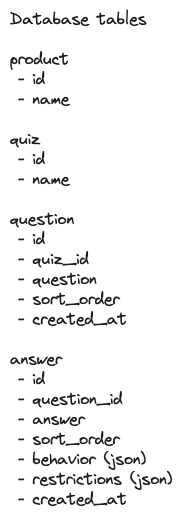
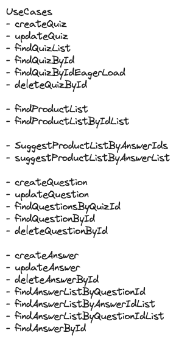
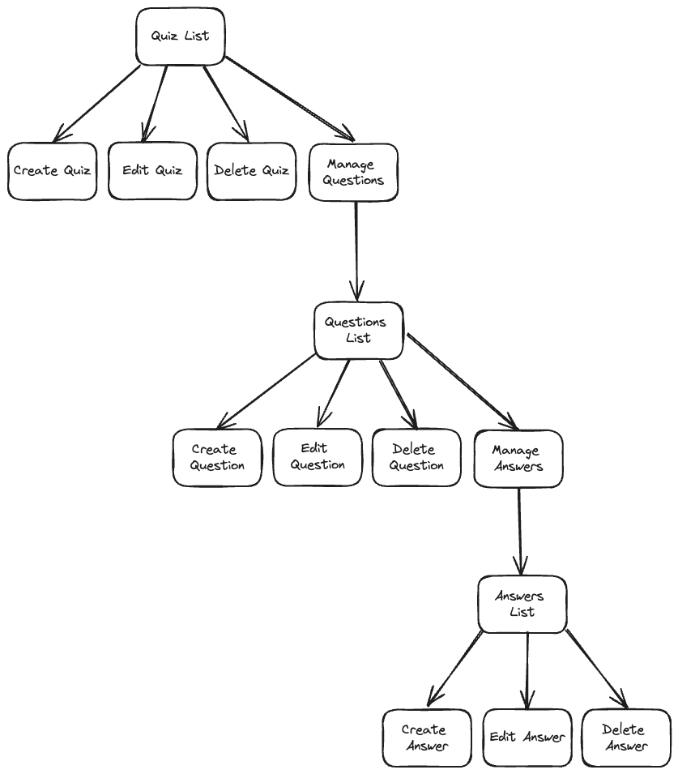

# Quiz

This application provides a quiz to suggest products after the user answers a few questions.

## Stack

- PHP 8.3
- MariaDB 11
- Nginx
- Symfony 7.1

For the developer environment it uses [nix](https://nixos.org/) + [devenv](https://devenv.sh/).

The [rooter](https://github.com/run-as-root/rooter) CLI tool was used to provision the environment.

## Installation

1. Clone the repository
2. Run `rooter env start` to start the development environment
3. Run `composer install` to install the dependencies
4. Run `bin/console doctrine:migrations:migrate` to create the database schema

## Architecture

This project an architecture based on the Hexagonal Architecture, clean archtecture and a simplified version of the DDD.

## Docs

### Database


### Use Cases


### Application Flow


## Useful commands

### Linting:
```bash
composer run sniffer
```

### PHPStan:
```bash
composer run phpstan
```

### Unit tests
```bash
composer run unit-test
```
